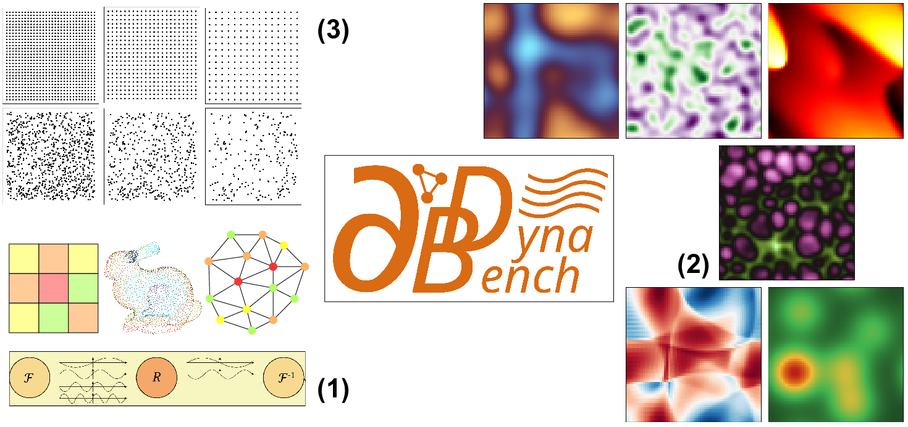
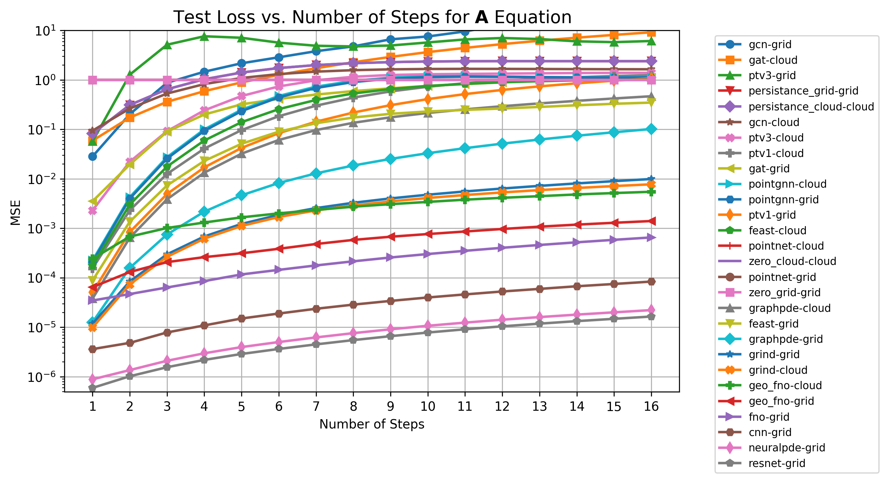
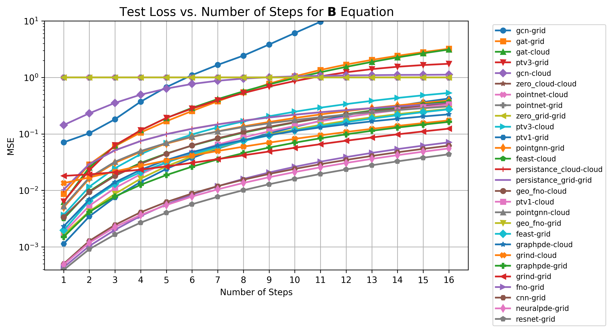
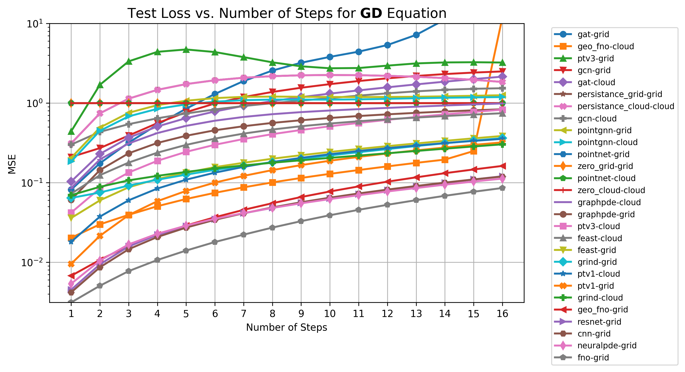
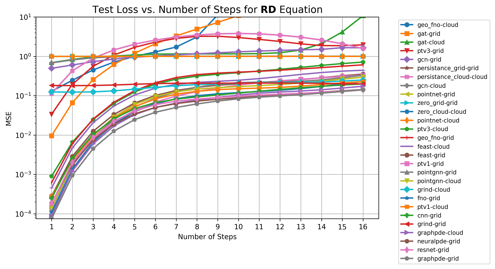
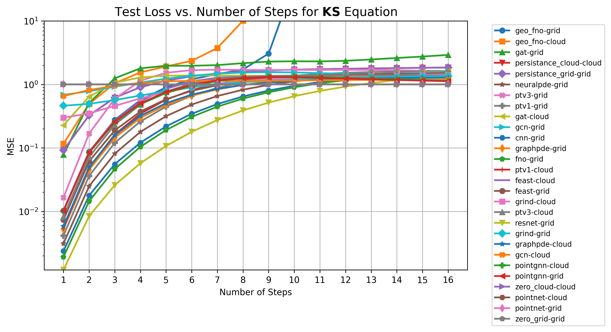
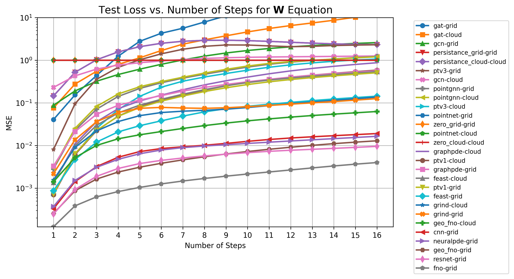

# Dynabench - Low-Data Benchmark




## How to get started
```bash
# set up a python environment
python3 -m venv env

# source the environment
source env/bin/activate

# install dependencies
pip install setuptools

pip install --no-build-isolation -r requirements.txt

pip install torch_cluster -f https://data.pyg.org/whl/torch-2.6.0+cu124.html
pip install torch-scatter -f https://data.pyg.org/whl/torch-2.6.0+cu124.html
```

Download data from the official Dynabench repository:
```shell
python3 download_data.py
```

After installing all requirements execute the main file and start the training or testing of the models for any of the given equations, domains and resolutions.
```shell
python3 main.py model={MODEL} equation={EQUATION} resolution={RESOLUTION} Structure={Structure} Batch_size={BATCH_SIZE} TrainRollout={TRAIN_ROLLOUT} version={VERSION} device={DEVICE}
```
For further setting check out the config files in the config folder...


## Results for the Dynabench Dataset

### Number of trainable parameter of the models ~2M
model | domain | A | B | GD | KS | RD | W
|---|---|---|---|---|---|---|---|
|cnn | grid | 2372097 | 2383618 | 2406660 | 2372097 | 2383618 | 2383618|
|geo_fno | grid | 2707395 | 2707780 | 2708550 | 2707395 | 2707780 | 2707780|
|ptv3 | grid | 2097560 | 2113936 | 2147168 | 2097560 | 2113936 | 2113936|
|ptv1 | grid | 1771905 | 1772098 | 1772484 | 1771905 | 1772098 | 1772098|
|pointnet | grid | 1977345 | 1978626 | 1981188 | 1977345 | 1978626 | 1978626|
|pointgnn | grid | 1852683 | 1853324 | 1854606 | 1852683 | 1853324 | 1853324|
|neuralpde | grid | 1928578 | 1938948 | 1959688 | 1928578 | 1938948 | 1938948|
|grind | grid | 1928578 | 1938948 | 1959688 | 1928578 | 1938948 | 1938948|
|graphpde | grid | 2110978 | 2117635 | 2130949 | 2110978 | 2117635 | 2117635|
|resnet | grid | 1776897 | 1782658 | 1794180 | 1776897 | 1782658 | 1782658|
|gcn | grid | 2113539 | 2116102 | 2121228 | 2113539 | 2116102 | 2116102|
|gat | grid | 2122760 | 2127888 | 2138144 | 2122760 | 2127888 | 2127888|
|fno | grid | 2123073 | 2123458 | 2124228 | 2123073 | 2123458 | 2123458|
|feast | grid | 2010835 | 2023696 | 2049418 | 2010835 | 2023696 | 2023696|
|graphpde | cloud | 2110978 | 2117635 | 2130949 | 2110978 | 2117635 | 2117635|
|geo_fno | cloud | 2707395 | 2707780 | 2708550 | 2707395 | 2707780 | 2707780|
|feast | cloud | 2010835 | 2023696 | 2049418 | 2010835 | 2023696 | 2023696|
|gcn | cloud | 2113539 | 2116102 | 2121228 | 2113539 | 2116102 | 2116102|
|pointgnn | cloud | 1852683 | 1853324 | 1854606 | 1852683 | 1853324 | 1853324|
|pointnet | cloud | 1977345 | 1978626 | 1981188 | 1977345 | 1978626 | 1978626|
|gat | cloud | 2122760 | 2127888 | 2138144 | 2122760 | 2127888 | 2127888|
|ptv1 | cloud | 1771905 | 1772098 | 1772484 | 1771905 | 1772098 | 1772098|
|ptv3 | cloud | 2097560 | 2113936 | 2147168 | 2097560 | 2113936 | 2113936|
|grind | cloud | 1928578 | 1938948 | 1959688 | 1928578 | 1938948 | 1938948|

### Test-loss for 1-temporal step in low resolution
model | domain | A | B | GD | KS | RD | W
|---|---|---|---|---|---|---|---|
|cnn | grid | 3.61e-06 | 5.02e-04 | 4.18e-03 | 2.38e-03 | 2.49e-04 | 3.28e-04|
|geo_fno | grid | 6.47e-05 | 1.66e-03 | 6.76e-03 | 1.03e-02 | 6.17e-04 | 2.54e-04|
|ptv3 | grid | 5.71e-02 | 6.36e-03 | 4.42e-01 | 1.65e-02 | 3.39e-02 | 8.05e-03|
|ptv1 | grid | 5.07e-05 | 1.14e-03 | 9.56e-03 | 4.16e-03 | 1.49e-04 | 7.25e-04|
|pointnet | grid | 1.00e+00 | 1.00e+00 | 9.99e-01 | 1.00e+00 | 9.99e-01 | 1.00e+00|
|pointgnn | grid | 2.09e-04 | 5.02e-03 | 2.05e-01 | 1.02e-02 | 1.33e-04 | 2.81e-03|
|neuralpde | grid | 8.83e-07 | 4.84e-04 | 5.37e-03 | 3.12e-03 | 1.87e-04 | 3.69e-04|
|grind | grid | 1.17e-05 | 1.81e-02 | 6.42e-02 | 4.63e-01 | 1.82e-01 | 2.18e-03|
|graphpde | grid | 1.25e-05 | 1.51e-03 | 6.10e-02 | 5.27e-03 | 7.51e-05 | 3.29e-03|
|resnet | grid | 5.93e-07 | 3.91e-04 | 4.51e-03 | 1.20e-03 | 1.83e-04 | 2.46e-04|
|gcn | grid | 2.83e-02 | 7.10e-02 | 2.10e-01 | 6.84e-01 | 4.96e-01 | 8.79e-02|
|gat | grid | 3.53e-03 | 8.69e-03 | 8.18e-02 | 7.82e-02 | 9.63e-03 | 4.06e-02|
|fno | grid | 3.46e-05 | 4.35e-04 | 3.13e-03 | 1.91e-03 | 1.08e-04 | 1.24e-04|
|feast | grid | 8.79e-05 | 1.96e-03 | 3.59e-02 | 7.38e-03 | 2.82e-04 | 8.67e-04|
|graphpde | cloud | 3.78e-05 | 2.31e-03 | 8.54e-02 | 5.82e-03 | 8.78e-05 | 1.30e-03|
|geo_fno | cloud | 2.43e-04 | 3.38e-03 | 2.03e-02 | 1.17e-01 | 1.29e-01 | 1.41e-03|
|feast | cloud | 1.75e-04 | 3.16e-03 | 7.27e-02 | 1.04e-02 | 4.51e-04 | 1.35e-03|
|gcn | cloud | 9.43e-02 | 1.44e-01 | 3.01e-01 | 6.57e-01 | 6.81e-01 | 2.31e-01|
|pointgnn | cloud | 2.23e-04 | 5.25e-03 | 1.85e-01 | 1.01e-02 | 1.37e-04 | 3.00e-03|
|pointnet | cloud | 1.00e+00 | 1.00e+00 | 9.99e-01 | 1.00e+00 | 9.97e-01 | 1.00e+00|
|gat | cloud | 5.92e-02 | 6.25e-03 | 1.03e-01 | 2.28e-01 | 6.91e-01 | 7.62e-02|
|ptv1 | cloud | 1.55e-04 | 1.79e-03 | 1.81e-02 | 5.51e-03 | 2.75e-04 | 7.00e-04|
|ptv3 | cloud | 2.30e-03 | 3.69e-03 | 4.20e-02 | 8.26e-03 | 9.02e-04 | 7.40e-04|
|grind | cloud | 9.89e-06 | 1.34e-02 | 6.97e-02 | 3.00e-01 | 1.24e-01 | 1.55e-03|

### Test-loss for 16-temporal steps in low resolution
model | domain | A | B | GD | KS | RD | W
|---|---|---|---|---|---|---|---|
|cnn | grid | 8.37e-05 | 6.20e-02 | 1.20e-01 | 1.55e+00 | 2.00e-01 | 1.91e-02|
|geo_fno | grid | 1.40e-03 | 2.78e-01 | 1.62e-01 | 3.65e+09 | 6.09e-01 | 1.29e-02|
|ptv3 | grid | 6.13e+00 | 1.75e+00 | 3.23e+00 | 1.63e+00 | 1.96e+00 | 2.31e+00|
|ptv1 | grid | 1.08e+00 | 4.24e-01 | 3.21e-01 | 1.62e+00 | 3.33e-01 | 5.10e-01|
|pointnet | grid | 1.00e+00 | 1.00e+00 | 9.99e-01 | 1.00e+00 | 1.00e+00 | 1.00e+00|
|pointgnn | grid | 1.12e+00 | 3.90e-01 | 1.26e+00 | 1.12e+00 | 3.31e-01 | 1.23e+00|
|neuralpde | grid | 2.22e-05 | 5.54e-02 | 1.13e-01 | 1.63e+00 | 1.43e-01 | 1.65e-02|
|grind | grid | 9.92e-03 | 1.24e-01 | 3.63e-01 | 1.36e+00 | 2.00e-01 | 1.26e-01|
|graphpde | grid | 1.02e-01 | 1.63e-01 | 8.36e-01 | 1.50e+00 | 1.41e-01 | 5.65e-01|
|resnet | grid | 1.64e-05 | 4.36e-02 | 1.20e-01 | 1.36e+00 | 1.42e-01 | 9.57e-03|
|gcn | grid | 3.29e+01 | 4.45e+02 | 2.50e+00 | 1.58e+00 | 1.65e+00 | 2.60e+00|
|gat | grid | 1.13e+00 | 3.22e+00 | 4.44e+01 | 2.92e+00 | 2.55e+02 | 5.04e+01|
|fno | grid | 6.53e-04 | 7.10e-02 | 8.57e-02 | 1.49e+00 | 2.29e-01 | 3.99e-03|
|feast | grid | 3.48e-01 | 2.73e-01 | 3.86e-01 | 1.44e+00 | 3.55e-01 | 1.44e-01|
|graphpde | cloud | 4.68e-01 | 2.22e-01 | 9.90e-01 | 1.28e+00 | 1.74e-01 | 8.76e-01|
|geo_fno | cloud | 5.48e-03 | 3.39e-01 | 1.19e+01 | 2.45e+05 | 9.80e+09 | 6.29e-02|
|feast | cloud | 1.02e+00 | 3.73e-01 | 7.46e-01 | 1.45e+00 | 4.44e-01 | 5.41e-01|
|gcn | cloud | 1.64e+00 | 1.12e+00 | 1.54e+00 | 1.19e+00 | 1.01e+00 | 1.26e+00|
|pointgnn | cloud | 1.13e+00 | 3.07e-01 | 1.19e+00 | 1.14e+00 | 2.96e-01 | 1.21e+00|
|pointnet | cloud | 1.00e+00 | 1.00e+00 | 9.99e-01 | 1.00e+00 | 1.00e+00 | 1.00e+00|
|gat | cloud | 9.19e+00 | 3.12e+00 | 2.15e+00 | 1.61e+00 | 1.08e+01 | 1.23e+01|
|ptv1 | cloud | 1.25e+00 | 3.33e-01 | 3.55e-01 | 1.46e+00 | 2.28e-01 | 5.87e-01|
|ptv3 | cloud | 1.39e+00 | 5.32e-01 | 8.26e-01 | 1.37e+00 | 7.15e-01 | 1.07e+00|
|grind | cloud | 7.76e-03 | 1.73e-01 | 3.03e-01 | 1.43e+00 | 2.51e-01 | 1.37e-01|


## Rollout Visualizations for all equations in low resolution
| | |
|:---------------------------------------:|:---------------------------------------:|
| **A**  | **B**  |
| **GD**  | **RD**  |
| **KS**  | **W**  |
| | |